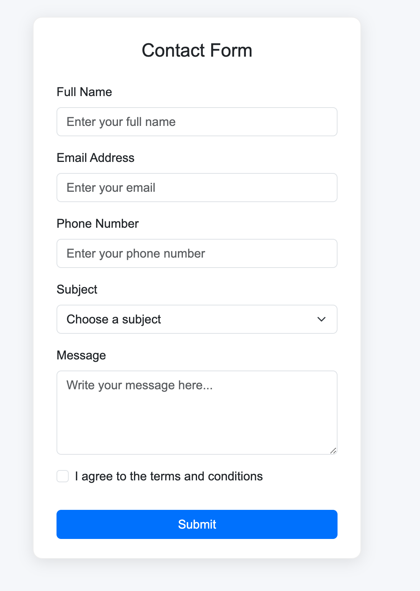
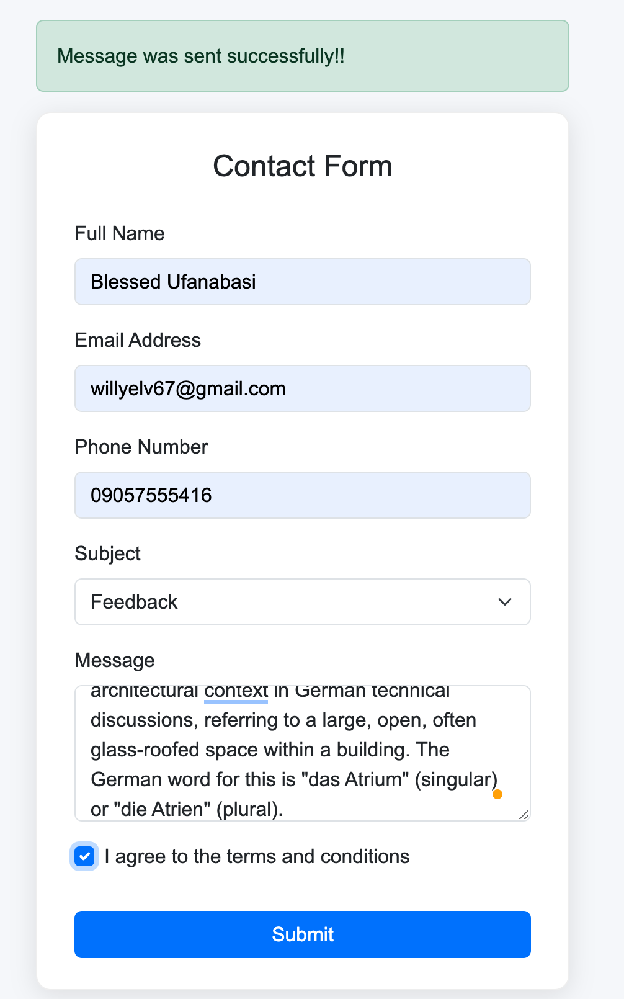
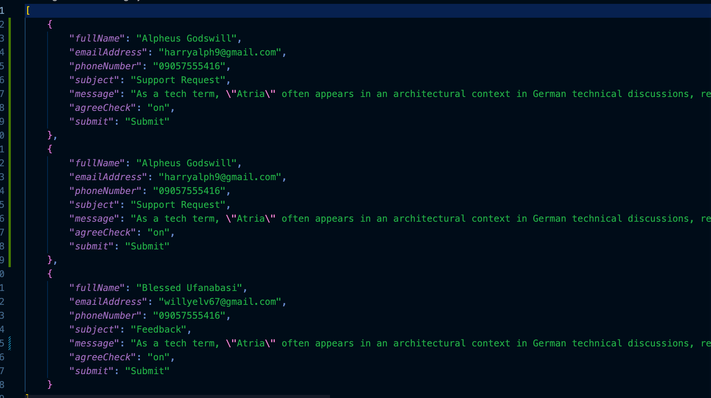

# Flask Contact Form Application

[](https://www.python.org/)
[](https://flask.palletsprojects.com/)
[](LICENSE)
[]()

This repository provides a Flask-based contact form application that captures user input, stores submissions in a JSON file, and displays a flash confirmation message to the user. It includes logging, data persistence, automatic directory creation, and a Bootstrap-powered UI.

---

## Features

- Responsive Bootstrap contact form
- Input fields include: Full Name, Email, Phone Number, Subject, Message, and Terms Agreement
- Submissions are saved to `contactmessage/message.json`
- Flash notification upon successful form submission
- Automatic creation of the data directory and JSON file on first run
- Logging of key events and error tracking through `Atria.log`

---

## Project Structure

.
├── app.py
├── contactmessage/
│   └── message.json
├── static/
│   └── style.css
├── templates/
│   └── contact.html
├── venv/
├── .env
├── .gitignore
├── Atria.log
├── README.md
└── requirements.txt

---

## Getting Started

### 1. Clone the Repository

```bash
git clone https://github.com/your-username/contact-form-flask.git
cd contact-form-flask
```

### 2. Create and Activate a Virtual Environment

```bash
python3 -m venv venv
```

Activate it:

```bash
# macOS/Linux
source venv/bin/activate

# Windows
venv\Scripts\activate
```

### 3. Install Dependencies

```bash
pip install -r requirements.txt
```

### 4. Configure Environment Variables

Create a `.env` file in the root of the project with the following:

```
SECRET_KEY="<YOUR_GENERATED_SECRET_KEY>"
```

Generate a secure secret key with:

```bash
python -c 'import secrets; print(secrets.token_hex())'
```

This key is required for flash messages to function.

### 5. Run the Application on MacOS

```bash
python3 app.py
```

Go to:

```
http://127.0.0.1:4000/
```

---

## How It Works

| Process         | Description                                                   |
| --------------- | ------------------------------------------------------------- |
| Form Submission | User submits form data through POST                           |
| Data Handling   | The app reads the JSON file, appends the new entry, and saves |
| Flash Message   | Confirms successful submission                                |
| Storage         | Data stored in `contactmessage/message.json`                  |
| Logs            | Application logs stored in `Atria.log`                        |

---

## Screenshots of Project

### Contact Form Interface



### Flash Message After Submission



### JSON File Showing Stored Messages



---

## Logging Details

The `Atria.log` file records:

* File and directory creation events
* Form submissions
* JSON read/write actions
* Errors and exceptions

---

## Tech Stack

| Component | Technology            |
| --------- | --------------------- |
| Backend   | Python, Flask         |
| Frontend  | HTML, Bootstrap 5     |
| Storage   | JSON                  |
| Logging   | Python Logging Module |

---

## Contributing

Contributions are welcome.
For UI changes, include a screenshot with your pull request.

---

## License

This project is licensed under the MIT License.


